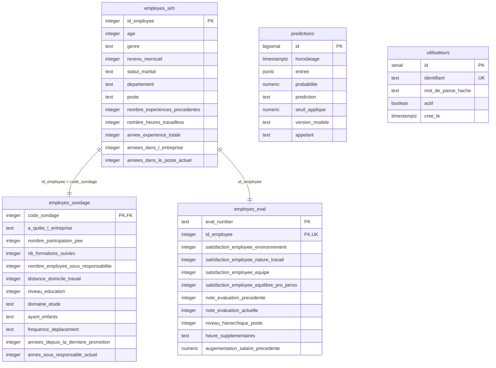

# API de prédiction du risque de démission

Service REST qui expose le modèle d'attrition de TechNova Partners. On lui
envoie les 26 informations d'un salarié, il renvoie une probabilité de départ
et une décision. Chaque appel est enregistré en base.

Le modèle vient du projet P4, où il vivait dans un notebook. Ici il devient un
service utilisable au quotidien par les RH : validé, testé, tracé, déployable.

## Prérequis

- Python 3.13
- PostgreSQL 17

## Installation

```powershell
git clone https://github.com/AraujoManon/P5.git
cd P5
python -m venv .venv
.venv\Scripts\Activate.ps1
pip install -e ".[dev]"
```

L'installation en `-e` (éditable) n'est pas un détail : `src/main.py` cherche
le modèle en remontant d'un dossier depuis sa propre position. Une installation
classique copierait `src/` dans `site-packages`, loin de `models/`.

`[dev]` ajoute pytest, pytest-cov, httpx et ruff. Sans ce suffixe, seules les
dépendances d'exécution sont installées.

Si `pip install` échoue sur « Could not find a suitable TLS CA certificate
bundle », c'est l'installateur PostgreSQL de Windows qui a posé une variable
`CURL_CA_BUNDLE` pointant vers un fichier qui n'existe pas. Contournement
immédiat :

```powershell
Remove-Item Env:\CURL_CA_BUNDLE
```

Durablement, supprimer cette variable dans les variables d'environnement
utilisateur de Windows.

## Configuration

Copier `.env.example` en `.env` et remplir les variables :

| Variable | À quoi elle sert |
|---|---|
| `DATABASE_URL` | connexion à la base `attrition`, utilisée par l'API |
| `DATABASE_ADMIN_URL` | connexion au serveur PostgreSQL, pour créer la base |
| `API_KEY` | clé de service attendue dans l'en-tête `X-API-Key` |
| `JWT_SECRET` | clé de signature des jetons d'accès |

Générer une clé ou un secret (la même commande sert aux deux) :

```powershell
python -c "import secrets; print(secrets.token_urlsafe(32))"
```

`.env` est dans `.gitignore` et n'est jamais versionné. Dans le conteneur, ces
valeurs arrivent par `--env-file` (voir [Déploiement](#déploiement)).

## Mettre en place la base

```powershell
attrition-creer-base
```

Crée la base, ses cinq tables et y charge les trois extraits CSV, soit 1470
salariés. La commande est rejouable : elle supprime et recrée les tables à
chaque exécution. Le schéma est défini dans `sql/schema.sql`.

Pour remplir `predictions` avec des exemples, en faisant tourner le modèle sur
tous les salariés de la base :

```powershell
attrition-scorer
```

Les lignes écrites portent `appelant = scorer` : ni un compte, ni la clé de
service. On distingue ainsi un score calculé en lot d'une prédiction demandée
par un appelant réel.

`data/exemples_predictions.csv` contient vingt de ces lignes, entrées et
sorties du modèle comprises, pour qui veut voir ce que la table contient sans
installer la base. Le fichier se régénère :

```powershell
$requete = "SELECT * FROM predictions WHERE appelant = 'scorer' ORDER BY id DESC LIMIT 20"
psql -U postgres -d attrition -c "\copy ($requete) TO 'data/exemples_predictions.csv' CSV HEADER"
```

## Schéma de la base

PostgreSQL 17, base `attrition`. Cinq tables : trois pour le jeu de données,
une pour tracer les appels au modèle, une pour les comptes d'accès à l'API.



### Relations et contraintes

| Table | Contrainte | Pourquoi |
|---|---|---|
| `employes_sondage` | `code_sondage` clé primaire et étrangère vers `employes_sirh` | un sondage appartient à un salarié existant, et un seul |
| `employes_eval` | `id_employee` clé étrangère et `UNIQUE` | une évaluation par salarié, rattachée à un salarié existant |
| toutes les colonnes des données | `NOT NULL` | un CSV incomplet échoue au chargement au lieu d'entrer à moitié |
| `predictions` | `CHECK (probabilite BETWEEN 0 AND 1)` | une probabilité hors bornes signale un bug, pas une donnée |
| `predictions` | `CHECK (prediction IN ('Oui', 'Non'))` | seules deux décisions existent |
| `utilisateurs` | `identifiant` `UNIQUE` | deux comptes ne peuvent pas porter le même nom |

`predictions` n'a pas de clé étrangère vers `employes_sirh` : l'API répond sur
des salariés qui ne sont pas forcément en base, un candidat ou un profil
hypothétique saisi par les RH. `utilisateurs` ne référence rien non plus : un
compte d'accès n'est pas un salarié de l'entreprise.

### Choix de modélisation

- **Trois tables plutôt qu'une.** Les données viennent de trois systèmes
  distincts. Chaque table garde la clé primaire de sa source. Les recoller en
  une table large aurait effacé cette origine.
- **`eval_number` en texte.** Le système d'évaluation numérote `E_1`, `E_2`…
  La table garde l'identifiant tel qu'il arrive, et `id_employee` porte la clé
  étrangère.
- **L'entrée des prédictions en `jsonb`.** Les 26 champs sont déjà décrits
  dans `src/schemas.py`. Les redéclarer en colonnes ferait deux endroits à
  modifier à chaque évolution. Le `jsonb` reste interrogeable.
- **`augementation_salaire_precedente` en `numeric`.** Le CSV contient
  `"11 %"`. La valeur est nettoyée à l'insertion pour que les calculs n'aient
  pas à le refaire.
- **`mot_de_passe_hache`**, jamais `mot_de_passe` : seul le hachage bcrypt est
  stocké. `actif` coupe un accès sans supprimer la ligne, et les prédictions
  déjà tracées continuent de désigner un compte qui existe.
- **`appelant` sur `predictions`** : le compte qui a demandé, ou `service` pour
  la clé d'API. Pour des données RH, savoir qu'une décision a été prise ne
  suffit pas, il faut savoir par qui.

### Volume

1470 lignes par table de données. `predictions` est la seule table qui grossit
avec l'usage : elle ne fait qu'ajouter des lignes. Un index sur `horodatage`
(ordre décroissant) garde rapides les requêtes de suivi, qui portent presque
toujours sur les appels récents.

## Entraîner le modèle

```powershell
attrition-entrainer
```

Produit `models/attrition_model.joblib` et `models/metrics.json`. Le dépôt
contient déjà un modèle entraîné : cette commande ne sert que si les données
ou le pipeline changent.

### Le modèle

Il estime la probabilité qu'un salarié quitte l'entreprise. Il a été entraîné
sur 1470 salariés, dont 237 départs (16 %). Ce déséquilibre est la difficulté
centrale du jeu de données.

Le pipeline tient en un seul objet scikit-learn, sauvegardé dans le `.joblib` :

| Étape | Rôle |
|---|---|
| `preparation` | nettoyage, encodage ordinal, 5 variables calculées |
| `encodage` | One Hot sur les 6 colonnes nominales |
| `undersampler` | rééquilibrage des classes, à l'entraînement seulement |
| `rf` | `RandomForestClassifier`, graine 42, hyperparamètres par défaut |

Tout est dans un seul objet pour que l'API applique exactement les mêmes
transformations que l'entraînement.

**Seuil de décision : 0.40**, et non 0.50. Rater un départ coûte environ dix
fois plus cher qu'une fausse alerte. Abaisser le seuil détecte plus de départs,
au prix de plus de fausses alertes.

**Performance** : rappel moyen de 0.83 (écart-type 0.06) en validation croisée
à 5 plis. La validation croisée fait foi, parce que le jeu de test ne contient
que 47 départs et qu'une mesure unique sur si peu de cas est instable. Sur ce
jeu de test, 37 départs sur 47 sont détectés. `tests/test_modele.py` fait
échouer la CI si le rappel passe sous 0.75.

**Limites** : peu de données, aucune explication de la prédiction et aucun
suivi de dérive pour l'instant. `note_evaluation_actuelle` ne vaut que 3 ou 4
dans les données : sur 1 ou 2, le modèle extrapole.

## Lancer l'API

```powershell
attrition-api
```

L'API écoute sur le port 8000, ou sur celui que donne la variable `PORT`.

- documentation interactive : http://127.0.0.1:8000/docs
- état du service : http://127.0.0.1:8000/health

## Appeler l'API

Avec la clé de service :

```powershell
$corps = Get-Content exemple.json -Raw
Invoke-RestMethod -Uri http://127.0.0.1:8000/predict -Method Post `
  -Headers @{ "X-API-Key" = $env:API_KEY } `
  -ContentType "application/json" -Body $corps
```

Avec un compte utilisateur :

```powershell
$jeton = (Invoke-RestMethod -Uri http://127.0.0.1:8000/token -Method Post `
  -Body @{ username = "martine"; password = "..." }).access_token

Invoke-RestMethod -Uri http://127.0.0.1:8000/predict -Method Post `
  -Headers @{ Authorization = "Bearer $jeton" } `
  -ContentType "application/json" -Body $corps
```

Réponse :

```json
{
  "probabilite_demission": 0.83,
  "prediction": "Oui",
  "seuil_applique": 0.4
}
```

La documentation interactive, sur `/docs` (Swagger) ou `/redoc`, décrit
chaque route, les 26 champs avec leurs bornes et leurs modalités, et donne un
exemple de requête prêt à envoyer. Elle est générée à partir des mêmes classes
Pydantic que celles qui valident les requêtes : elle ne peut pas diverger du
code.

| Code | Quand |
|---|---|
| 200 | prédiction rendue et tracée en base |
| 401 | aucune authentification, jeton invalide ou expiré, clé incorrecte |
| 422 | champ manquant, hors bornes, modalité inconnue ou champ en trop |
| 500 | `API_KEY` ou `JWT_SECRET` absent du serveur, ou trace en base impossible |

Une prédiction qui ne peut pas être tracée échoue au lieu d'être rendue : pour
des données RH, une décision sans trace n'est pas acceptable.

## Authentification et gestion des accès

Deux méthodes, parce qu'il y a deux sortes d'appelants.

**Les comptes utilisateurs**, pour les humains. On envoie son identifiant et
son mot de passe à `/token`, on reçoit un jeton valable trente minutes, et on
le présente ensuite dans l'en-tête `Authorization: Bearer <jeton>`. Créer un
compte, ou changer son mot de passe :

```powershell
attrition-creer-utilisateur martine
```

Le mot de passe est saisi sans écho, douze caractères minimum, et n'est jamais
stocké : seul son hachage bcrypt part en base.

**La clé de service**, pour l'outil RH. Un automate n'a pas de mot de passe à
saisir ni de session à renouveler : il présente son en-tête `X-API-Key`. Faire
tourner un compte utilisateur dans un programme reviendrait à y écrire un mot
de passe en dur, ce qui est exactement ce qu'on cherche à éviter.

Dans les deux cas, l'appelant identifié est écrit dans la colonne `appelant`
de la table `predictions` : on sait qui a demandé quoi. `/health`, lui,
n'exige rien — la supervision et l'hébergeur doivent pouvoir vérifier que le
service tourne sans détenir de secret.

### Les bonnes pratiques appliquées

**Les mots de passe sont hachés, pas chiffrés.** Un chiffrement se déchiffre ;
un hachage, non. bcrypt tire en plus un sel aléatoire par mot de passe, donc
deux comptes ayant choisi le même mot de passe ont deux hachages différents, et
une table de hachages précalculés ne sert à rien. Son coût de calcul est
volontairement élevé, ce qui rend l'essai systématique de millions de
combinaisons beaucoup trop lent pour être rentable.

**Les échecs d'authentification se ressemblent tous.** Compte inconnu, mot de
passe faux, compte désactivé : même code, même message. Et quand le compte
n'existe pas, un hachage leurre est quand même comparé — sans lui, une réponse
instantanée signalerait que l'identifiant n'existe pas, et il suffirait de
mesurer le temps de réponse pour dresser la liste des comptes réels.

**La clé d'API est comparée en temps constant.** Une comparaison ordinaire
s'arrête au premier caractère faux, donc sa durée trahit le nombre de
caractères justes ; sur un grand nombre d'essais, la clé se reconstitue.

**Les jetons expirent au bout de trente minutes** et sont signés. Un jeton
intercepté ne vaut pas éternellement, et un jeton fabriqué sans le secret est
rejeté.

**Un refus donne 401, pas 403.** 403 signifie « je sais qui tu es, mais c'est
interdit ». Ici on ne sait rien du demandeur.

**Les secrets ne sont pas dans le dépôt.** `API_KEY`, `JWT_SECRET` et
`DATABASE_URL` sont des variables d'environnement : un fichier `.env` ignoré
par git en développement, les secrets de la plateforme en production. Aucun mot
de passe n'apparaît dans les journaux ni dans la table des prédictions.

## Traitement et stockage des données

Le cycle de vie d'une donnée, de son arrivée à son exploitation.

| Étape | Ce qui se passe | Où ça vit |
|---|---|---|
| Collecte | trois extraits CSV : SIRH, sondage interne, évaluations | `data/` |
| Chargement | `attrition-creer-base` rejoue le schéma et insère les trois fichiers | PostgreSQL, 3 tables |
| Préparation | nettoyage, encodages, 5 variables calculées | en mémoire, dans le pipeline |
| Entraînement | `attrition-entrainer` produit le modèle et ses métriques | `models/` |
| Prédiction | l'API valide, transforme, prédit | en mémoire |
| Traçabilité | chaque appel est écrit avec son entrée complète | table `predictions` |
| Extraction | un échantillon de la table, exporté pour consultation | `data/exemples_predictions.csv` |

Trois principes gouvernent ce découpage.

**La donnée source n'est jamais modifiée.** Les fautes de frappe des CSV
(`augementation`, `annes`) sont conservées jusque dans les noms de colonnes de
l'API. Les corriger imposerait une table de correspondance entre le fichier et
le service, qu'un oubli rendrait fausse en silence.

**La préparation est écrite une seule fois.** Le même code sert à
l'entraînement sur 1470 lignes et à la prédiction sur une seule. Deux copies
finiraient par diverger sans que rien ne le signale.

**Rien n'est écrasé.** La table `predictions` ne fait qu'ajouter. Une décision
prise il y a six mois reste consultable telle qu'elle a été rendue, avec le
seuil et la version du modèle de l'époque.

### Ce que la base permet côté analyse

Les données sont stockées de façon à rester exploitables par un analyste ou un
tableau de bord, sans passer par l'API. `attrition-requetes` en donne quatre
exemples exécutables :

| Question | Ce qu'on en tire |
|---|---|
| taux de départ par département | où se concentre le risque |
| taux de départ selon les heures supplémentaires | le facteur le plus parlant du jeu de données |
| les cinq derniers appels au modèle | le service est-il utilisé, et par qui |
| répartition des prédictions | combien de salariés signalés, à quelle probabilité moyenne |

L'entrée est stockée en `jsonb`, donc chaque champ reste interrogeable sans
être redéclaré en colonne :

```sql
SELECT entree->>'departement' AS departement,
       count(*)               AS appels,
       round(avg(probabilite), 3) AS risque_moyen
FROM predictions
GROUP BY 1
ORDER BY risque_moyen DESC;
```

Un tableau de bord RH construit là-dessus afficherait le nombre de salariés
signalés par département, l'évolution du risque moyen dans le temps, et le
volume d'appels par compte utilisateur. La même table servira à surveiller la
dérive : comparer la distribution des entrées reçues à celle des données
d'entraînement, et alerter quand elles s'éloignent.

## Environnements

Trois environnements, une seule et même configuration : des variables
d'environnement. Rien à changer dans le code pour passer de l'un à l'autre.

| | Développement | Test | Production |
|---|---|---|---|
| Base | PostgreSQL local | base jetable `attrition_test` | PostgreSQL local, joint depuis le conteneur |
| Variables | fichier `.env` | `DATABASE_TEST_URL`, posée par la CI | `.env.docker` en local, secrets de l'environnement GitHub `production` dans le pipeline |
| Lancement | `attrition-api` | `pytest` | conteneur Docker |
| Port | 8000 par défaut | sans objet | 8000, publié par `-p` |
| Modèle | `models/attrition_model.joblib` | idem | embarqué dans l'image |

Le fichier `.env` n'existe qu'en développement. Il est lu au démarrage par
`python-dotenv`, qui ne remplace jamais une variable déjà présente dans
l'environnement. Le fichier n'est pas copié dans l'image : dans le conteneur,
ce sont les variables passées au lancement qui s'appliquent. Chez un hébergeur,
ce seraient ses secrets, sans rien changer au code.

La base de test est délibérément une base à part. Le schéma commence par des
`DROP` : le faire tourner sur la base de travail l'effacerait.

## Tests

```powershell
pytest
```

65 tests, 100 % de couverture sur `src/`. La couverture est activée par défaut
dans `pyproject.toml`, il n'y a rien à ajouter à la commande.

Douze d'entre eux parlent à un vrai PostgreSQL : ils vérifient qu'une
prédiction s'insère et se relit, qu'elle se supprime, et que le schéma refuse
ce qu'il doit refuser — probabilité hors bornes, décision hors vocabulaire,
colonne obligatoire absente, clé étrangère orpheline, âge en toutes lettres,
identifiant de compte en double. Ils sont sautés si `DATABASE_TEST_URL` est
absente, et la CI fournit cette base. Ne jamais y mettre la base de travail :
le schéma commence par des `DROP`.

```powershell
createdb attrition_test   # une fois, ou via pgAdmin
pytest tests/test_integration_bdd.py
```

Pour le rapport détaillé en HTML :

```powershell
pytest --cov-report=html
start htmlcov/index.html
```

`htmlcov/` n'est pas versionné : un rapport se régénère. La CI en publie un
à chaque exécution, téléchargeable depuis l'onglet Actions.

## Intégration et déploiement continus

`.github/workflows/ci.yml` enchaîne deux jobs à chaque push.

**`qualite`** lance ruff puis la suite de tests, sur Ubuntu et Python 3.13. Il
échoue si le formatage n'est pas conforme, si un test casse, ou si le rappel du
modèle livré passe sous 0.75. Un service `postgres:17` est démarré le temps de
l'exécution, pour les tests qui vérifient les contraintes du schéma. Le rapport
de couverture est publié en artefact téléchargeable, y compris quand un test
échoue.

**`deploiement`** ne part que si `qualite` a réussi, et seulement sur `main`.
Il :

1. vérifie que les secrets de production sont configurés ;
2. construit l'image Docker, ce qui installe les dépendances ;
3. la démarre avec ces secrets, face à une base PostgreSQL neuve ;
4. appelle `/health`, puis `/predict` avec la clé d'API, et vérifie qu'une
   ligne est arrivée dans `predictions` ;
5. publie l'image sur GitHub Container Registry, sous
   `ghcr.io/araujomanon/attrition-api`, étiquetée `latest` et avec le SHA du
   commit.

Une image qui ne démarre pas, ou qui ne trace pas ses prédictions, n'est jamais
publiée.

Les secrets `API_KEY` et `JWT_SECRET` sont rangés dans l'environnement GitHub
`production` (Settings › Environments), pas dans les secrets du dépôt : seul le
job qui déclare `environment: production` y a accès. La publication utilise le
`GITHUB_TOKEN` fourni par GitHub, limité au droit `packages: write`.

Les tags ne déclenchent rien : ils pointent sur un commit qui vient d'être
testé.

## Déploiement

L'API est déployée en local, dans un conteneur Docker. Depuis septembre 2026,
les Spaces Docker de Hugging Face sont payants et le projet accepte un
déploiement local.

Le conteneur est ce qui distingue ce déploiement du développement : l'API ne
tourne plus depuis l'environnement Python de la machine, mais depuis une image
figée qui embarque le code, les dépendances et le modèle. La même image
tournerait telle quelle chez un hébergeur.

**1. Préparer les variables.** Copier `.env` en `.env.docker`, puis remplacer
`localhost` par `host.docker.internal` dans `DATABASE_URL`. Dans un conteneur,
`localhost` désigne le conteneur lui-même, pas la machine où tourne
PostgreSQL. `.env.docker` est ignoré par git, comme `.env`.

**2. Récupérer l'image.** Celle que le pipeline a testée et publiée :

```powershell
docker pull ghcr.io/araujomanon/attrition-api:latest
docker tag ghcr.io/araujomanon/attrition-api:latest attrition-api
```

Ou la construire depuis le dépôt :

```powershell
docker build -t attrition-api .
```

**3. Lancer le conteneur.** Docker Desktop et PostgreSQL doivent tourner.

```powershell
docker run --rm -p 8000:8000 --env-file .env.docker attrition-api
```

`--env-file` évite d'écrire la clé d'API et le mot de passe dans la commande,
où ils resteraient dans l'historique du terminal.

**4. Vérifier.** http://127.0.0.1:8000/health doit répondre, puis un appel à
`/predict` (voir [Appeler l'API](#appeler-lapi)) doit renvoyer une prédiction
et ajouter une ligne dans `predictions`.

L'image part de `python:3.13-slim`, tourne sous un utilisateur non privilégié
et lit son port dans `PORT`.

## Commandes disponibles

| Commande | Ce qu'elle fait |
|---|---|
| `attrition-api` | démarre l'API |
| `attrition-entrainer` | entraîne le modèle et écrit les métriques |
| `attrition-creer-base` | crée la base et charge les CSV |
| `attrition-creer-utilisateur` | crée un compte d'accès à l'API |
| `attrition-scorer` | prédit sur tous les employés de la base |
| `attrition-requetes` | exécute les requêtes d'analyse sur la base |

Elles sont déclarées dans `pyproject.toml` et installées avec le paquet.

## Organisation du dépôt

```
src/          le service : contrat de données, pipeline, sécurité, API
scripts/      les commandes hors service : création de base, entraînement
tests/        65 tests, un fichier par module testé
data/         les trois extraits CSV fournis, et un extrait des prédictions
models/       le modèle entraîné et ses métriques
sql/          le schéma de la base
exemple.json  un corps de requête valide pour /predict
```

## Documentation

- documentation interactive de l'API : `/docs` (Swagger) et `/redoc`, une fois
  le service lancé
- contrat de données : `src/schemas.py`, qui valide chaque requête et génère
  la documentation interactive
- schéma SQL : `sql/schema.sql`
- métriques du modèle livré : `models/metrics.json`
